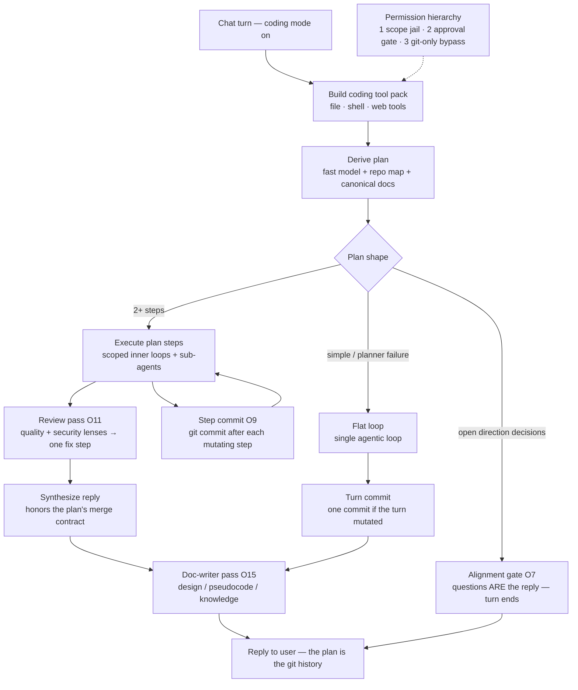
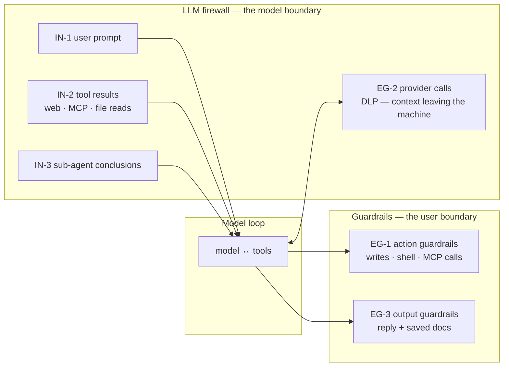
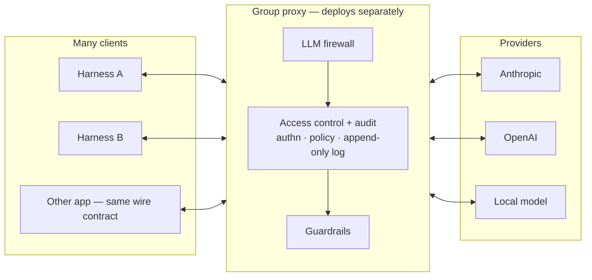
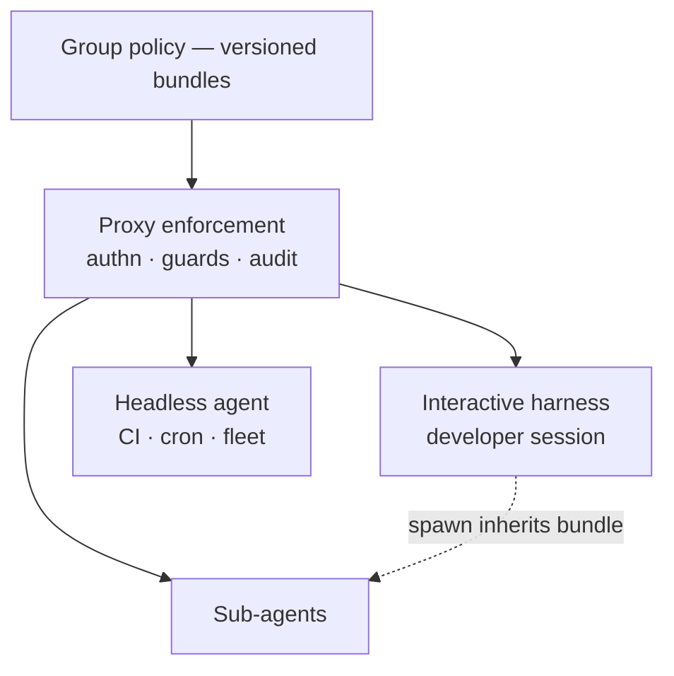

# Coding Harness — Turn Flow, Comparison, and the Next Ring

How a coding-mode turn actually flows through the shipped harness (§1), how
that design compares to the other systems in this space (§2), where the
current orchestration falls short of its own plan schema (§3), and the design
for the next ring: plan-established orchestration with real parallel
execution and merge contracts (O16), and a modular guard chain — an LLM
firewall at the model boundary and guardrails at the user boundary, with
named plug-in points (O17).

Companion docs: `HARNESS_OBJECTIVES.md` (the SPEC — objective IDs cited
here), `PLANNING_ARCHITECTURE.md` (the plan-and-execute design this builds
on), `PIPELINE_PSEUDOCODE.md`.

---

## 1. The turn flow as shipped



The through-line: **model actions are gated by irreversibility; recording
actions are deterministic framework code.** Writes flow freely only where
git can undo them (O4); commits, decision records, and doc versions are
bookkeeping the model cannot skip and a failure in them cannot break a turn
(O9, O15). Every stage lands in process events — the glass box (O14).

Key mechanics per stage:

- **Tool pack** (`coding-tools.js`): ten file/shell tools + web tools, all
  returning the MCP `{text, isError}` contract (O2). The jail resolves
  symlinks before checking scope (O1); shell env is allowlisted (O6).
- **Derive plan** (`plan-derive.js`): plans against a real repo map and the
  canonical project docs as source of truth — never by re-reading code
  (O15). Failure degrades to the flat loop; planning can never make a turn
  worse (O12).
- **Execution** (`execute.js`): each step is a budgeted inner loop over the
  shared VariableStore; stuck steps trigger bounded re-planning (≤3), then
  user escalation (O12). Between-step compaction structurally protects the
  KNOWN VALUES digest.
- **Review** (`review.js`): plan path only; quality + security lenses over
  the actual changed file contents, validated findings, ONE fix step,
  committed (O11).
- **Doc-writer** (`doc-writer.js`): both paths; a turn that mutated files
  never ends unrecorded or undocumented (O15).

---

## 2. Comparison to other systems

The systems fall into three families; the harness deliberately straddles
them.

### 2a. Coding harnesses (Claude Code, Aider, OpenCode, Kimi Code CLI)

| Dimension | Claude Code | Aider | This harness |
|---|---|---|---|
| Planning | implicit / plan mode on request | none (chat-driven) | derived per turn from skills + docs + repo map, alignment gate before direction-setting work |
| Parallelism | model-driven subagents; deterministic only in Workflows | none | plan-declared `parallel` flags (isolation today — see §3) |
| Merge | model improvises; Workflow scripts encode merge stages | n/a | plan-level `merge` contract honored at synthesis |
| Permissions | permission modes + allowlists + hooks | git-diff confirm loop | 3-level hierarchy priced by irreversibility (O4) |
| Git discipline | user-driven commits | auto-commit per edit | step-commits: the plan IS the history (O9) |
| Post-hoc review | on request | none | automatic quality+security pass with one bounded fix cycle (O11) |
| Docs as truth | CLAUDE.md conventions | none | canonical SPEC/DESIGN/KNOWLEDGE maintained by the pipeline (O15) |
| Observability | transcript | chat log | glass box: every selection, gate, commit, and pass is a process event (O14) |

Claude Code's closest analog to what O16 needs is its Workflow/hooks layer:
deterministic fan-out scripts with explicit barriers and merge stages, and
`PreToolUse`/`PostToolUse` hooks as guard ingress points. Both are *adjacent*
to its main loop; O16/O17 build the equivalents *into* the turn model.

### 2b. Agent frameworks (LangGraph, AutoGen, CrewAI, OpenAI Agents SDK)

- **LangGraph** — the orchestration gold standard: an explicit DAG with
  fan-out/fan-in edges, map-reduce via its Send API, and **merge as reducer
  functions on shared state channels**. Its weakness is that the graph is
  authored in code ahead of time. Our planner *derives* the graph per
  request; what we lack is LangGraph's structural fan-in — which is exactly
  the O16 gap (§3).
- **AutoGen** — GroupChat with an LLM manager choosing speakers; merging is
  whatever the manager says. Flexible, unauditable, unbounded. Our
  alignment gate + bounded re-planning is the deliberate opposite.
- **CrewAI** — sequential or hierarchical process with a manager agent;
  role-based task lists. Parallelism is coarse (async tasks), merge is
  manager prose. Same critique.
- **OpenAI Agents SDK** (Swarm lineage) — handoffs between agents, and the
  most relevant precedent for O17: **guardrails are first-class typed
  hooks** (input/output guardrails with tripwires that halt the run). Ours
  should be modular like that, but sit at *more* points (tool results and
  provider egress, not just user input and final output) and stay
  deterministic-first.

### 2c. Guard / firewall systems (NeMo Guardrails, Llama Guard, LLM gateways)

- **NVIDIA NeMo Guardrails** names the ingress/egress taxonomy: input
  rails, output rails, tool rails, retrieval rails. That taxonomy maps
  cleanly onto our choke points (§4) — we adopt the shape without the
  Colang runtime.
- **Llama Guard / Prompt Guard / Rebuff** — classifier models for policy
  and injection detection. These are *guard implementations*, pluggable
  behind our guard interface, never the framework itself.
- **LLM gateways** (LiteLLM proxy, Kong AI gateway, Cloudflare AI Gateway)
  — firewalls at the network hop: key custody, PII scrubbing, rate/policy.
  A desktop harness owns its own egress, so EG-2 (§4) is our equivalent of
  the gateway hop, in-process.
- **Harness.io** (already cited in the SPEC) — approval stages and gates as
  pipeline structure. Our approval gate is that idea; O17 generalizes it
  from "ask the human" to "run the guard chain, the human is the final
  guard."

---

## 3. The O16 gap — parallel is isolation, not concurrency; merge is final-only

What the plan schema already promises (`plan-derive.js`):

- per-step `delegate`, `agent`, `parallel` flags,
- a plan-level `merge` string honored by `synthesize()`,
- the `assign` tool, which really does `Promise.all` + an optional
  `mergeResults` instruction — but only when the *model* chooses to call it.

What the executor actually does (`execute.js`): steps marked `parallel` are
handed to `runParallel` **one at a time, awaited in order**. Today
`parallel: true` buys context isolation (a sub-agent, only its conclusion
returns) — it does not buy concurrency. And `merge` exists only at final
synthesis: there is no way to say "steps 2–4 fan out, merge their results
*this way*, and step 5 consumes the merged product."

So the user-visible promises of the schema are ahead of the runtime. O16
closes the gap:

**The plan establishes the orchestrator.** `submit_plan` gains:

```
orchestrator: {
  merge: "how to combine fan-out results (structure, dedupe rules, format)",
  on_conflict: "prefer newest | prefer source X | surface both",
  model: "optional override for merge calls (default: fast model)"
}
steps[i].group: "string — steps sharing a group AND marked parallel run
                 concurrently; the group's merged result is one step-result"
steps[i].consumes: "optional — names of groups/steps whose products this
                    step needs (documents the dependency the ordering implies)"
```

The principle the user set: **the intelligence that divides the work must
also know how to merge it.** Division without a recombination contract is
how fan-out becomes fan-mess — every framework above that merges "by
manager prose" demonstrates it.

**Executor change (contained):** when the next step begins a group, collect
the consecutive same-group parallel steps, run them via `Promise.all(
runParallel(step))`, then one `mergeResults` call using the group's merge
instruction (falling back to `orchestrator.merge`). The merged text becomes
a single step-result; `captureFromResult` harvests it into the store so
later steps consume it as KNOWN VALUES. Stuck/replan semantics are
unchanged — a failed group member degrades to its error conclusion and the
merge sees it (surfacing partial fan-outs is the merge instruction's job).

Bounds (O12 discipline): group size ≤ 4 concurrent sub-agents; a group is
one step for budget purposes; merge is one bounded fast-model call; merge
failure degrades to concatenation — never breaks the turn.

---

## 4. The O17 design — guard chain: the LLM firewall and guardrails

The harness already has guards; they are just not *named as a surface*. The
jail, the approval gate, `filterToolResult`, the shell-env allowlist — each
is a hard-coded guard at a choke point. O17 turns those choke points into a
**registry of named points** that modules plug into, so protection is an
addition, not surgery.

### Terminology (ratified 2026-08-08)

The guard modules form two families at two different **trust boundaries** —
not two directions:

- **LLM firewall** — the perimeter around the *model*. Inbound, it protects
  the LLM from prompt injection (untrusted content entering context: user
  prompt, web pages, MCP results, sub-agent conclusions). Outbound, it
  protects the *user's data* — DLP scrubbing of context leaving the machine
  at the provider hop. DLP sits in the firewall family even though the data
  is "leaving," because content entering the LLM **is** data exiting the
  user's machine — one choke point seen from two sides. (A local model
  collapses the DLP hop entirely; the firewall points remain.)
- **Guardrails** — the last checkpoint before the *user*. Output guardrails
  protect the person: malicious URLs, abusive language, unsafe content in
  replies and saved documents. Action guardrails protect their *system*:
  policy on tool calls (path rules, command lint, secrets written to disk),
  with the human approval gate as the final action guardrail.

Verdict idiom follows the family — a firewall *drops* or *sanitizes*; a
guardrail *refuses*, *redacts*, or *warns* — but both express it through the
same module contract below, so the runtime has one shape.

### The points



| Point | Family | Today (already a guard) | What plugs in |
|---|---|---|---|
| IN-1 user prompt | firewall | — | prompt-injection / policy classifiers before planning |
| IN-2 tool results | firewall | `filter.js` filterToolResult (size/noise) | injection scanning on untrusted content (web pages, MCP results); provenance tagging |
| IN-3 sub-agent conclusions | firewall | `captureFromResult` shape rules | same scanners; conclusions are model-authored from untrusted inputs |
| EG-2 provider calls | firewall (DLP) | shell-env allowlist is the sibling (O6) | secret/PII scrub of outbound context; per-provider redaction policy |
| EG-1 tool calls | action guardrails | jail (O1) + approval gate (O4) + denied() contract | programmatic policy *before* the human: path rules, command lint, secret detection in written content — the human stays the final guardrail |
| EG-3 reply + docs | output guardrails | — | malicious-URL checks, abusive/unsafe content, secrets in generated deliverables |

### The module contract

Mirrors the patterns the codebase already trusts — everything injected,
one result shape, best-effort bookkeeping:

```
guard = {
  name,                       // shown in process events
  point,                      // 'IN-1' … 'EG-3'
  inspect(payload, ctx) →     // deterministic-first; MAY be a classifier model
    { verdict: 'allow' | 'block' | 'rewrite' | 'flag',
      payload?,               // rewrite: the replacement content
      reason }                // always — verdicts are glass-box events
}
```

Rules, in the harness's own idiom:

1. **Deterministic-first.** Regex/policy/entropy guards run before any
   classifier-model guard; model guards are bounded calls on the fast model
   and their failure is `flag`, never `block` (a broken guard must not
   break a turn — O12).
2. **Block reuses the denial contract.** A blocked EG-1 action returns the
   existing `denied()` text ("do not retry — continue without it"), so the
   model-facing semantics are identical to a human decline (O4).
3. **Rewrite is visible.** A rewritten payload emits a process event with
   before/after sizes and the guard's reason — no invisible context
   engineering, the differentiator the SPEC names (O14).
4. **Order is registry order; chains short-circuit on block.** The human
   approval gate is the *last* action guardrail, so programmatic guardrails
   reduce prompts (auto-blocking obvious violations) rather than adding
   friction.
5. **Scope never moves.** The jail is not a guard module and is not
   pluggable — level 1 stays non-bypassable framework code (O1/O4). Guards
   add restriction; they can never add permission.

### 4c. Deployment — from internal chain to group proxy (O18)

Today the firewall and guardrails are **undefined — pure passthroughs**, and
that is a valid state: the chain's existence is the contract, not any
particular module. What must be true from day one is that the pattern
`firewall → LLM → guardrail` is a **boundary object** that can be lifted out
of the app and deployed on its own:



**Three topologies, one contract.** Because a verdict is a serializable
value (`{verdict, payload?, reason}`), the same guard module runs:

1. **In-process** (today, internal) — the registry calls `inspect()`
   directly. Default for solo use; passthrough costs nothing.
2. **Local sidecar** — same machine, separate process; the app's chain
   delegates a point to it. Isolation without infrastructure.
3. **Group proxy** — a separately deployed service fronting a team. One
   policy, one audit trail, many clients. The proxy IS the provider
   endpoint as far as clients are concerned (base-URL swap in
   `providers/`), which is why this works without touching the loop code.

**Why the proxy sits at the wire hop.** EG-2 is the only point that is
already a network call, and the provider request/response pair carries
almost the whole pattern: the request contains the full assembled context
(everything IN-1/2/3 admitted — the firewall inspects and DLP-scrubs it);
the response contains the completion (output guardrails inspect it, and
tool calls inside it can carry policy verdicts back to the client). Two
things can never move to the proxy: tool *execution* and the human approval
gate — those act on the user's machine and stay client-side. A pure
gateway product can't see IN-2/IN-3 provenance or run the human gate; the
proxy shares the harness's guard contract, so it can.

**Access control.** The proxy authenticates every caller (per-user/app
credential), then authorizes against group policy: allowed models, guard
profiles per role, tool policy, quotas. Provider keys live only at the
proxy — clients hold a proxy credential, never a provider key. This is the
key-custody argument that justifies the deployment even with all guards
still passthrough.

**Audit.** Append-only, per event: `{caller, point, guard, verdict,
reason, content refs}` — group policy chooses hash-only references vs full
capture (the DLP/privacy tradeoff is the group's to make, not ours).
Client-side process events record the proxy's audit id, so the glass box
(O14) spans the wire: a turn's local trace and the group's central log
join on one identifier.

**Failure posture is policy, not accident.** Proxy unreachable →
fail-closed for managed groups (no unaudited traffic), fail-open permitted
for solo/dev configs. Either way the client says which posture it honored
in its process events.

### 4d. Shared controls — the proxy as control plane (O19)

O18 gives the deployment a shared *data plane* (traffic through one
enforcement point). Agentic development needs the *control plane* too: the
LLM controls themselves — guard profiles, model access, tool policy,
approval policy — defined once and **shared** to every actor in the
deployment, because an agentic team is not one developer at one keyboard.
It is developer sessions, headless CI and cron agents, and the sub-agents
any of them spawn. Per-machine configuration cannot govern that; a shared
bundle can.



**The policy bundle.** On session start a client authenticates and fetches
its bundle — resolved from its identity by the proxy:

```
bundle = {
  policy_version,             // joins every audit row and process event
  guard_profiles,             // per point: which modules run, in what order
  models,                     // allowlist + defaults per role
  tool_policy,                // path rules, command classes, MCP scopes
  approval_policy,            // what still asks a human, and whom
  fail_posture                // closed (managed) | open (solo/dev)
}
```

The client applies the bundle to its local guard registry. Four rules make
it sound:

1. **Tighten-only merge.** Local config can add restriction on top of the
   bundle, never remove it — the O17 axiom ("guards add restriction, never
   permission") applied at deployment scale. A loosening attempt is
   ignored and logged.
2. **Inheritance is total.** A sub-agent, a delegated plan step, a spawned
   worker — each receives the resolved bundle of its parent. Delegation is
   never an escape hatch from policy; the tree can only get tighter toward
   the leaves.
3. **No unmanaged path.** Headless runs resolve bundles via app
   credentials exactly like interactive sessions. If it talks to a model
   through the deployment, it has a bundle.
4. **Versioned and joinable.** Every process event and audit row carries
   `policy_version`, so an audit answers both "what happened" and "which
   rules were in force when it happened" — and a policy rollout is itself
   an auditable event.

**Precedents.** OPA's policy-as-code distribution (bundles pulled by
enforcement points) is the mechanical model; the zero-trust control/data
plane split is the architecture; Claude Code's managed settings — admin
policy that user config cannot override — is the direct product precedent
for tighten-only merge. The difference here: the bundle configures the
*same guard registry* that runs in-process (O17), so one policy document
governs a solo laptop, a sidecar, and a thousand-agent fleet without
translation.

### Why this shape

- OpenAI's guardrails prove typed hooks with tripwires are ergonomic;
  NeMo proves the input/output/tool/retrieval taxonomy covers real
  deployments; the gateways prove egress scrubbing belongs at the boundary.
  This design takes the taxonomy, the hook ergonomics, and the boundary
  placement, and keeps our own two non-negotiables: irreversibility pricing
  (O4) and the glass box (O14).
- Every existing guard (filter, approval, env scrub) becomes the reference
  implementation of its point — the registry formalizes what shipped code
  already does, so v1 is a refactor plus two new guards (IN-2 injection
  scan, EG-2 secret scrub), not a platform build.

---

## 5. The documents harness — design (O20–O25)

DOCUMENTS mode graduates from a system-prompt veneer to a harness with the
same triad as coding: hands (collect + manage), conscience (provenance),
method (the lifecycle). Ratified terminology: **format** = what we
PRODUCE, **type** = what we CONVERT to, **placement** = where it lives.

### 5a. The document model

```
format definition (authorable, like agents/skills — skills can ship them)
  name        "msoc-monthly" | "health-report" | "plan" | …
  family      → default placement {category}
  audience    who reads it (align gate input)
  sections[]  ordered; each holds prose slots and widget slots
  contract    what data must be collected to fill it

composed document = format + content + widget data (+ source manifest)
  → render(type)     markdown | html | pdf   — DETERMINISTIC
  → place(template)  {customer}/{category}/{title}.{ext}, versioned
```

The model's job ends at *compose*: it collects, analyzes, and fills the
format with prose and widget DATA. Rendering (widgets → markup),
conversion (html → pdf via Electron `printToPDF`, already in the runtime —
no new dependencies), and placement are framework code — same principle as
step-commits: recording actions are deterministic and cannot be skipped or
improvised.

### 5b. Widgets — data → presentation

Five component families fill format slots: **callout**, **analysis**,
**summary**, **table**, **chart** (bar, line, donut, radar, heatmap).
One contract:

```
{ widget: "chart", data: {...}, options: { kind: "donut", ... } }
```

Rules:
1. The model authors **data, never markup** — one shared renderer replaces
   the N hand-rolled HTML reports the MSSP skills produce today, and every
   document gets the same visual system.
2. Charts render as **self-contained inline SVG** — no CDN, no external
   requests: pdf conversion and offline viewing are print-faithful.
3. Every widget defines its **markdown degradation**: chart → caption +
   data table, callout → blockquote, summary → lead paragraph, table →
   md table. One composition, three faithful types.
4. Structured widget data makes verification mechanical: the verify pass
   compares chart/table numbers against collected values and their
   sources without parsing markup.

### 5b-2. Format targets v1 (SHIPPED 2026-08-09)

The first working slice of "the user gives an output format and every
document meets that design":

- A **format target** is a complete sample document (html) installed in
  the library's `formats/` folder — branding, fonts, masthead, section
  styling, tables, chart styling, print rules, shown *in context*. The
  per-project `output_format` setting names one explicitly; otherwise a
  single file in `formats/` is auto-selected.
- DOCUMENTS mode names the target in the mode note; the planner context
  carries it with a rule to read it before any compose step; the compose
  contract is "reproduce the visual system exactly, replace the content."
- **Skills carry sections; the system carries the design.** The
  expo-monthly-report skill was slimmed to section semantics + data
  discipline; its visual rules now defer to the format target. Swapping
  the file re-brands every future deliverable with zero skill edits.
- Ratified exception to self-containment: the format's web-font
  stylesheet links (e.g. fonts.googleapis.com) are the ONLY permitted
  external references — every font-family keeps its fallback stack so
  offline rendering degrades gracefully. Everything else stays inline.
- v2 (open): format targets become authorable ROWS with a data contract
  (§5a), enforcement moves from prose to the widget renderer (O25), and
  the verify pass checks design conformance mechanically.

**Document targets UI (SHIPPED 2026-08-09).** The project OVERVIEW gains a
DOCUMENT TARGETS card with three entries, and chat ↔ form parity:

- **Target Document Format** — shows the active format target; ADD FORMAT…
  copies a chosen sample into the library's `formats/` folder (canonical
  location: `<library root>/formats/`, a sibling of the placement tree)
  and selects it; a dropdown switches when several exist.
- **Target Document Branding** — free text (masthead label, accent colors,
  footer/confidentiality line) applied on top of the format.
- **Include raw data (Excel)** — checkbox; when on, every report is
  accompanied by a spreadsheet of the collected datasets. The model
  authors DATA (`{"sheets":[{name, rows}]}` via save_document format
  "xlsx"); `spreadsheet.js` renders the file deterministically
  (SpreadsheetML v1 — zero deps, multi-sheet; native .xlsx zip is v2).
- **Parity**: DOCUMENTS mode knows when format/branding are missing and
  asks (align decisions) instead of inventing; targets the user states in
  chat are recorded (`document_format` / `document_branding` /
  `document_rawdata`) and written to the SAME per-project settings the
  Overview form shows — either surface fills them, both stay true.

### 5c. Placement — the managed taxonomy

`placementPath` today knows `{type} {tenant} {period} {title} {ext}`; it
generalizes to ANY property token so the operator's example files as
`{customer}/{category}/{title}.{ext}` → `acme/monthly-reports/
2026-08-security-report.html`, versioned on re-save. Category defaults
from the format's family; per-project placement templates override the
global one; the DOCUMENTS tab renders the same tree so what the user
browses is literally how it is stored. Management verbs (supersede,
archive, sets, cross-references) are library metadata — never file
deletion.

### 5d. Lifecycle and terminology migration

The turn shape (O22): **align** (audience, format, type — O7 extended) →
**collect** in parallel (the first customer of O16 groups + merge) →
**analyze** into working memory → **compose** → **verify** (document
lenses: claims-vs-sources, completeness, internal consistency, format
contract; one bounded fix cycle) → **publish** (render + place +
version) → **maintain** on later turns (revise, never recreate).
Provenance (O21) rides the whole pipeline: collection captures sources
like the store captures ids; the manifest publishes with the document;
an unsourced claim is a review finding.

Terminology migration note: the shipped `save_document` schema uses
`type` for the semantic label and `format` for the file extension —
exactly inverted from the ratified terms. The tool schema migrates with
O24 (`format` = template name, `type` = render target), with a
compatibility mapping for old saves.

## 6. Findings from live console testing (2026-08-08)

Driving the running app over CDP (remote-debugging port + `window.api`)
surfaced these; each is an open item until struck through:

1. **No isolated test profile.** ~~Overriding `HOME` does not redirect
   `app.getPath('userData')` on macOS — a "scratch" launch wrote to the
   real database.~~ **FIXED**: `--user-data-dir=<path>` in main.js sets
   userData before `openDatabase`.
2. **Remote debugging is total control.** ~~The packaged app should refuse
   the flag.~~ **FIXED**: packaged builds quit on
   `--remote-debugging-port`/`--inspect`; development keeps them.
3. **Skill tool ceilings couple to MCP server labels.** Imported and
   authored skills pin tools as `<ServerLabel>__<tool>` (e.g.
   `Fluency_Expo__list_cases`). Renaming the server silently widens the
   ceiling to the full catalog (graceful, by design) — but a label rename
   should offer to remap skill ceilings. OPEN.
4. **`skills:create` has no duplicate-name guard.** **FIXED**: repo-level
   check refuses a duplicate name with a clear error.
5. **One composition ≠ many types.** ~~No conversion, no pdf.~~ **FIRST
   SLICE SHIPPED** (O24): `documents:toPdf` renders a library html doc to
   a sibling pdf via an offscreen hardened window + `printToPDF`;
   live-verified on the first Expo monthly report (398 KB pdf from a
   15 KB self-contained html). Markdown as a render target still open.
6. **Formats are prose until O24/O25.** The `expo-monthly-report` skill
   carries its format (`expo-monthly-v1`) as frontmatter + rules the model
   must obey; nothing structural enforces section order or widget
   discipline. OPEN — but live run #1 complied: all nine sections present
   in order, 2 inline-SVG charts, zero external requests.
7. **Provider idle timeout vs thinking models.** The openai-compat stream
   idle timeout (90 s without a delta) aborted a healthy Kimi request
   mid-think — the turn died with no reply persisted and the failure was
   invisible in the UI. **FIXED** (idle → 300 s); the deeper items remain
   OPEN: a provider abort should land as a visible error turn, and the
   turn's partial work should be saved like a user STOP.
8. **renderVars crash on non-array.** `chats:variables` can resolve to a
   non-iterable, crashing the KNOWN VALUES rail. **FIXED** (defensive
   array check).
9. **documents:toPdf double-parsed properties.** `repo.documents.get`
   returns parsed properties; the handler re-parsed and the pdf was
   written but not indexed. **FIXED**.
10. **Imported skills and cached tool listings drift silently.** MCP
   imports are snapshots of a server that keeps moving (found live: the
   Fluency Expo cache carried 4 tools the server no longer offers).
   **FIXED — MCP version-drift sync (2026-08-09)**: `mcp:checkSync`
   compares the live server against the app — skill versions via the
   server's `version_check` catalog vs local frontmatter versions, tool
   listings vs the `tools_json` cache — and the UI badges drift (amber
   titlebar MCP chip + per-server "⟳ N skill updates · N tools removed"
   chip) with a one-click UPDATE that reconnects (re-caches tools) and
   re-imports updated skills. Checks run at boot (deferred) and on MCP
   page open; connection failures are tolerated silently. Skill-version
   drift additionally requires the server's version_check payload to
   carry per-skill versions.

## 7. Status

O16–O19 (§E) and O20–O25 (§F) are specified in `HARNESS_OBJECTIVES.md` and
are **PLANNED** — this document is their design record. The shipped flow in
§1 is current as of the public-release commits on `main`. Build order:
O17's registry (with passthrough modules) is the prerequisite for O18's
proxy, and O18's authenticated identity is the prerequisite for O19's
bundle resolution — each ring reuses the previous one, never reimplements
it. The documents harness rides the same rings: collection uses O16
groups, publication passes O17's EG-3 output guardrails.
