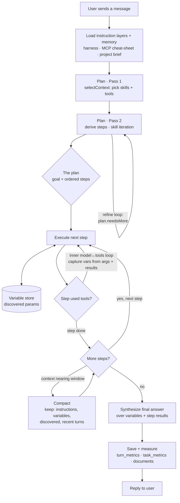

# Planning Architecture — Plan-and-Execute with a Variable Store

Status: **DESIGN — pre-implementation** · Branch: `feature/planning` · Supersedes the single-loop turn model in `chat-loop.js` for complex turns.

This document is the coding plan for the plan-and-execute rework. It captures the
mental model, the flowchart, the pseudocode, the reuse/new/modify map against the
existing code, the constraints we must not break, the open decisions, and a phased
build order with measurable objectives. Read this before writing any code on this
branch.

---

## 1. Why we are changing the turn model

Today a turn is **one flat agentic loop** (`runChatLoop`): call the model, run any
tools it asks for, feed results back, repeat until it stops or hits an iteration
cap. That works, but it has three structural weaknesses this rework targets:

1. **No explicit plan.** The model improvises the whole task inside one loop. There
   is nothing to inspect, approve, or measure at the *step* level, and nothing that
   tells the model "you are on step 3 of 5" — so it drifts, repeats work, or stops
   early (the "didn't finish" class of bugs we already patched around with forced
   wrap-up).
2. **No working memory of discovered parameters.** Tool parameters we discover mid-
   turn (a tenant id, a case id, a file path, an account GUID) live only in the raw
   message history. When compaction fires, those values can be summarized away — and
   then a later tool call can't be formed. The user called this out directly:
   *"when we call tools, we have parameters ... often we've discovered [them] in
   previous parts of the conversation ... we need to maintain a history of those
   parameters."*
3. **Instruction layers are implicit.** The MCP cheat-sheet and the project brief
   are stuffed into the system prompt ad hoc. There is no defined precedence or
   lifecycle for them.

The fix is a **plan-and-execute** turn: layer the instructions, plan explicitly in
two passes, execute step-by-step against a **persistent variable store**, and
compact in a way that *never* drops the variable store.

---

## 2. Relationship to the existing `planner.js`

We already have a `planner.js` — but it is a **different strategy** and it stays.

| | `planner.js` (exists) | plan-and-execute (this doc) |
|---|---|---|
| Shape | Parallel **decompose → merge** | Sequential **plan → execute → synthesize** |
| Steps run as | Isolated sub-agents, no shared state | One agent, **shared variable store** across steps |
| Best for | Independent sub-tasks fanned out (research N things, merge) | Dependent tasks where step N needs values discovered in step N-1 |
| Merge | AI-merge of isolated conclusions | Synthesis over accumulated variables + step results |

They are **siblings**, selected by the plan itself: a derived step may be marked
`parallel` and delegated to `planner.js`/`runSubagent`, while dependent steps run
inline through the new executor. We are not replacing decompose-and-merge; we are
adding the sequential, stateful path it lacks.

---

## 3. Instruction layers (precedence, highest wins on conflict)

Every turn is assembled from these layers, in this order:

1. **Harness rules** — provider-agnostic system framing, safety, output contract.
   Fixed, ships with the app.
2. **MCP cheat-sheet** — the connected server's routing/usage guidance
   (`routing_cheatsheet`-style). Tells the model how *this* toolset is meant to be
   used. Loaded once per turn, cache-friendly (stable prefix).
3. **Project brief** (`project.cheat_sheet`) — the user's per-project standing
   instructions and domain context.
4. **Loaded skills** — full instructions for the skills `selectContext` chose this
   turn (opt-out: on by default, minus per-project disables).
5. **Variable store digest** — the current working memory (see §5), rendered as a
   compact, always-present block so discovered parameters survive compaction.
6. **Conversation history** — recent turns verbatim; older turns compacted.
7. **The user's message.**

Layers 1–3 form a **stable prefix** (good for prompt caching); 4–7 vary per turn.

---

## 4. Flowchart



The three shapes that did not exist in the old flat-loop picture: **Pass 2 step
derivation** (D, with its refine loop), the **Variable store** (V, read/written by
every step), and **step-scoped execution** (F/G/H replacing one monolithic loop).

---

## 5. The Variable Store

Working memory of **discovered tool parameters and derived values**, carried across
steps within a turn and (optionally) persisted across turns of a chat. It is the
piece that makes step N able to use what step N-1 found, and the piece compaction
must protect.

**Shape (per entry):**

```
{
  key:        'tenant_id',            // stable, model- and tool-addressable
  value:      'acme-prod',            // the discovered value
  type:       'string',              // string | number | id | path | json
  source:     'list_tenants#call_3',  // provenance: which tool call / step produced it
  step:        2,                     // step index that captured it
  confidence: 'observed',            // observed (from a tool result) | derived (model-computed) | user
  ts:          <turn-relative seq>    // ordering; NOT wall-clock (see constraints)
}
```

**Capture** happens two ways (see open decision #3):

- **Auto-extract** — after each tool call, harvest `call.args` (the parameters the
  model *used* are, by definition, resolved values worth remembering) and run a
  light extraction pass over the tool *result* for obvious id/path/key fields.
- **Explicit** — a synthetic `set_variable(key, value, type?)` tool the model can
  call to record a value it derived or chose deliberately.

**Rendering** — the store is serialized into layer 5 as a compact table so it is
always in front of the model:

```
KNOWN VALUES (use these exact values when a tool needs them):
- tenant_id = "acme-prod"   (from list_tenants, step 2)
- case_id   = "C-10432"     (from list_cases, step 3)
```

**Persistence** — in-memory for a turn; a `variables` table (or a `variables_json`
column on the chat) lets it survive across turns and app restarts. Scope: per chat.

---

## 6. Pseudocode

Injected dependencies (`chat`, `callTool`, `selectContext`, `summarize`, store)
keep every function unit-testable without a live model — same discipline as the
current `runChatLoop`/`makePlan`.

```js
async function handleTurn({ chat, callTool, model, chat_id, userText, deps }) {
  // 1. Instruction layers + memory (§3)
  const layers = loadInstructionLayers({ chat_id, deps });   // harness, mcp cheat, project brief
  const store  = await loadVariableStore(chat_id);            // §5, may be empty

  // 2. Plan · Pass 1 — pick skills + tools (REUSE context-select.js)
  const { skillNames, toolNames } = await selectContext({
    connector: deps.connector, model: deps.fastModel,
    skills: deps.projectSkills, tools: deps.connectedTools, userText,
  });
  const loadedSkills = deps.projectSkills.filter(s => skillNames.includes(s.name));
  const { tools }    = applyToolCeiling({ loadedSkills, toolNames, allTools: deps.connectedTools });

  // 3. Plan · Pass 2 — derive steps (skill iteration, NEW)
  let plan = await derivePlan({ chat: deps.fastChat, layers, loadedSkills, tools, store, userText });
  while (plan.needsMore) {                                    // refine loop (open decision #2)
    plan = await refinePlan({ chat: deps.fastChat, plan, layers, store });
  }

  // 4. Execute each step against the shared variable store (NEW executor)
  const stepResults = [];
  let history = seedHistory(layers, store, userText);
  for (const step of plan.steps) {
    if (step.parallel) {                                       // hand off to decompose-and-merge sibling
      stepResults.push(await runSubagentStep(step, { callTool, ...deps }));
      continue;
    }
    const r = await executeStep({ chat, callTool, model, step, tools, history, store, deps });
    history = r.history;                                       // step's trace stays in-turn
    stepResults.push(r.result);
    history = await maybeCompactKeepingStore({ history, store, model, summarize: deps.summarize });
  }

  // 5. Synthesize over accumulated variables + step results
  const answer = await synthesize({ chat, model, goal: plan.goal, stepResults, store });

  // 6. Persist + measure
  await saveVariableStore(chat_id, store);
  await recordTurnMetrics({ chat_id, plan, stepResults, usage: aggregateUsage(stepResults) });
  return { answer, plan, store, stepResults };
}

// One step = a scoped inner model↔tools loop that CAPTURES variables as it goes.
async function executeStep({ chat, callTool, model, step, tools, history, store, deps }) {
  const budget = step.budget || DEFAULT_STEP_BUDGET;
  history = [...history, { role: 'user', content: renderStepDirective(step, store) }];
  for (let i = 0; i < budget; i++) {
    const res = await chat({ model, messages: history, tools });
    const calls = res.toolCalls || [];
    if (calls.length === 0) {
      return { result: { step: step.id, conclusion: res.text, usage: res.usage }, history };
    }
    history.push({ role: 'assistant', content: res.text, toolCalls: calls });
    for (const call of calls) {
      if (call.name === 'set_variable') { store.set(call.args, { step: step.id, confidence: 'derived' }); }
      captureFromArgs(store, call.args, step.id);              // auto-extract: used params are resolved values
      const out = await callTool(call.name, call.args);
      const filtered = filterToolResult(call.name, out.text, { cap: 24000 });  // REUSE filter.js
      captureFromResult(store, call.name, out.text, step.id);  // auto-extract obvious ids/paths/keys
      history.push({ role: 'tool', toolCallId: call.id, name: call.name, content: filtered.text });
    }
  }
  // Step exhausted its budget — force a tool-less conclusion (open decision #1:
  // per-step continue-at-limit prompt vs. the current global turn-level prompt).
  return { result: await forceStepConclusion({ chat, model, history, step }), history };
}

// Compaction that STRUCTURALLY protects the variable store (extends compress.js).
async function maybeCompactKeepingStore({ history, store, model, summarize }) {
  // keep = [ instruction layers, VARIABLE STORE DIGEST, discovered artifacts, recent turns ]
  // Only the middle of the raw tool trace is summarized; §5 store is re-injected verbatim.
  return maybeCompress({ messages: history, contextWindow: contextWindowFor(model),
                         summarize, keepRecent: 6, protect: renderStore(store) });
}
```

---

## 7. Reuse / New / Modify map

| Concern | Module | Action |
|---|---|---|
| Pass 1: skill + tool selection | `context-select.js` `selectContext` / `applyToolCeiling` | **Reuse as-is** |
| Noise filter on tool results | `filter.js` `filterToolResult` | **Reuse as-is** |
| History compaction | `compress.js` `maybeCompress` | **Modify** — add a `protect` block so the store + instruction layers are never summarized |
| Structured-output contract | `evaluator.js` `extractJson` / forced-tool pattern | **Reuse** for `derivePlan`/`set_variable` schemas |
| Decompose-and-merge (parallel steps) | `planner.js` / `subagent.js` | **Reuse** as the `step.parallel` branch |
| Flat turn loop | `chat-loop.js` `runChatLoop` | **Keep** for simple turns; the new executor is `executeStep`, factored from it |
| Pass 2: step derivation | — | **New** `plan-derive.js` (`derivePlan`, `refinePlan`) |
| Variable store | — | **New** `variables.js` (in-memory store + capture helpers + render) |
| Step executor + turn orchestrator | — | **New** `execute.js` (`executeStep`, `handleTurn`) or fold into an evolved `planner.js` |
| Persistence | `db/schema.sql` + `db/repo.js` | **Modify** — `variables` storage + step-level metrics |

Net new files: `plan-derive.js`, `variables.js`, `execute.js`. Everything else is
reuse or a bounded extension.

---

## 8. Constraints (must not break)

- **Provider-agnostic.** All new model calls go through the connector abstraction
  (`connector.chat`), never a provider SDK directly. Normalized usage
  `{inputTokens, outputTokens, cachedTokens, cacheCreationTokens}` must keep flowing.
- **Security model.** Secrets stay in the main process (safeStorage/Keychain).
  Renderer talks only via the preload bridge. The variable store may hold discovered
  *parameters* — treat it as potentially sensitive; it lives main-side and is never
  logged in plaintext to the renderer beyond the glass-box views the user opted into.
- **`node:sqlite` + `PRAGMA user_version` migrations.** Any schema change is a new
  numbered migration (next is **v14**), column-existence-guarded, additive.
- **Forced tool-calling for structured output**, with the offered-tool retry
  fallback — some thinking models reject a forced `tool_choice` (HTTP 400). Reuse the
  exact pattern already in `selectContext`.
- **Thinking-model budgets.** The fast/utility model may be a thinking model
  (`kimi-k2.6`): planning and extraction calls need generous `maxTokens` and a
  `reasoning_content` fallback. Recommend a non-thinking `fast_model` in docs.
- **No `Date.now()`/`Math.random()` assumptions in ordering.** Variable-store
  ordering uses a turn-relative sequence, not wall-clock, so it is deterministic and
  test-reproducible.
- **Glass box.** Every new stage emits events for the INTERNALS tab
  (CONTEXT/PROCESS/REVIEW): plan derivation, each step start/end, every variable
  capture, each compaction. Exposing the internals is the product thesis — nothing
  in this pipeline is a black box.
- **Opt-out skills.** Skills remain on by default minus per-project disables.
- **Determinism for tests.** Injected `chat`/`callTool`/`summarize` so `smoke.js`
  can drive the whole turn with no live model.

---

## 9. Design considerations & OPEN DECISIONS

Three decisions are still open. Current recommendation is the default the code will
assume unless changed:

1. **Continue-at-limit granularity** — when a *step* exhausts its iteration budget,
   do we prompt to continue **per-step**, or keep the existing **global** turn-level
   continue prompt?
   **Recommendation: per-step.** Finer control, matches the `executeStep` loop, and a
   stuck step shouldn't force the whole turn to re-prompt.

2. **Skill iteration: loop or single pass** — does Pass 2 refine the plan in a
   `while plan.needsMore` loop until it stabilizes, or run once?
   **Recommendation: single pass to start.** Add the refine loop only if derived
   plans come out underspecified in practice. Cheaper, simpler, fewer fast-model
   calls; the loop is scaffolded but capped at 1 iteration initially.

3. **Variable capture mechanism** — explicit `set_variable` tool, automatic
   extraction pass, or both?
   **Recommendation: both.** Auto-extract from every `call.args` (used params are
   resolved values) plus an explicit `set_variable` for derived/chosen values. Auto
   gives recall for free; explicit gives the model a deliberate handle.

Other considerations logged for the build:
- **When to plan at all.** Trivial turns (a greeting, a one-line question) shouldn't
  pay for two planning passes. Gate: if Pass 1 selects no skills and ≤1 tool, skip
  Pass 2 and run the simple `runChatLoop`. Measure the gate's hit rate.
- **Plan approval UX.** Optional user approval of the derived plan before execution
  (planner.js already assumes approval). Default: auto-run, show the plan in the
  glass box; make approval a per-project toggle later.
- **Store key collisions.** Same logical key rediscovered with a new value → keep
  latest, retain prior in provenance; never silently overwrite a `user`-confidence
  value with an `observed` one without noting it.

---

## 10. Data model changes (migration v14)

Additive only, column-existence-guarded, matching the existing migration style:

- `chats.variables_json TEXT` — the per-chat variable store snapshot (or a
  normalized `variables` table if we want history/provenance queries; start with the
  JSON column, promote to a table only if queried).
- `turn_metrics`: add `plan_steps INTEGER`, `plan_refines INTEGER`,
  `vars_captured INTEGER` so the glass box can measure the planner itself.
- `task_metrics` already carries per-task duration+tokens — reuse for per-step.

---

## 11. Phased build order with measurable objectives

Each phase is independently commit-able, smoke-tested, and observable in the glass
box before the next begins.

**Phase P0 — Variable store (foundation).** `variables.js`: in-memory store,
`captureFromArgs`, `captureFromResult`, `set_variable` tool schema, `renderStore`.
Migration v14 (`chats.variables_json`) + repo load/save.
- *Objective:* a step can write a value and a later step reads the exact value back;
  round-trips across a save/load; survives a forced compaction. Smoke-verified.

**Phase P1 — Step executor.** `execute.js` `executeStep` factored from `runChatLoop`,
with variable capture wired and per-step budget + continue-at-limit (decision #1).
- *Objective:* a two-step turn where step 2's tool call is formed **only** from a
  value step 1 discovered, driven entirely by injected mocks. Smoke-verified.

**Phase P2 — Plan derivation (Pass 2).** `plan-derive.js` `derivePlan` (+ scaffolded
`refinePlan`, capped per decision #2), using the forced-tool structured-output
pattern. Wire Pass 1 (`selectContext`) → Pass 2 → executor in `handleTurn`.
- *Objective:* derived plans are well-formed (goal + ordered steps) ≥95% of runs on a
  fixture set; the trivial-turn gate skips planning for greetings. Measured:
  `plan_steps`, `plan_refines`.

**Phase P3 — Compaction that protects the store.** Extend `maybeCompress` with a
`protect` block; re-inject the store digest + instruction layers verbatim.
- *Objective:* after compaction fires mid-turn, every variable captured before it is
  still usable in a subsequent step. Smoke-verified with a forced-overflow fixture.

**Phase P4 — Glass-box + telemetry.** Emit plan/step/capture/compaction events;
surface a PLAN lens (or extend PROCESS) in INTERNALS; record v14 metrics.
- *Objective:* a real turn shows its plan, per-step timing, and variable captures in
  the UI; `turn_metrics` reads back `plan_steps`/`vars_captured`.

**Phase P5 — Integration + parallel-step handoff.** `step.parallel` routes to
`planner.js`/`runSubagent`; synthesize over the mixed results; end-to-end live run.
- *Objective:* one turn that mixes a sequential step (uses the store) and a parallel
  step (fanned out + merged) produces a coherent synthesized answer. Live-validated.

Global success metric for the rework: on a scripted multi-step task, **zero**
"formed a tool call from a value that was compacted away" failures, and a plan that
is inspectable at every step in the glass box.

---

## 12. Risks

- **Two planning passes add latency and fast-model cost.** Mitigation: the trivial-
  turn gate, single-pass Pass 2 to start, and Pass 1 is already paid for today.
- **Thinking fast-model burns budget before emitting the plan.** Mitigation: generous
  `maxTokens`, `reasoning_content` fallback, and the standing recommendation to set a
  non-thinking `fast_model`.
- **Over-capture pollutes the store.** Mitigation: cap store size, prefer id/path/key
  shapes in `captureFromResult`, decay/evict least-recently-used within a turn.
- **Scope creep vs. the existing flat loop.** Mitigation: keep `runChatLoop` for
  simple turns; plan-and-execute only earns its keep on multi-step work.
