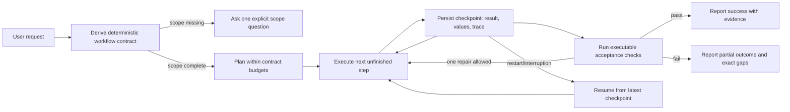

# Shamrock Reliability Improvement Plan

## Outcome

Shamrock should finish multi-part work predictably, survive interruption, prove that its deliverables satisfy the request, avoid invented scope or evidence, stay within a declared work budget, and keep authenticated connectors usable and understandable.

## Current-state gaps

| Need | Current behavior | Target behavior | Executable proof |
| --- | --- | --- | --- |
| Workflow contracts | The planner returns free-form steps and a merge instruction. | Every substantial turn gets a deterministic contract containing task kind, scope, evidence rules, budgets, and acceptance checks. | Contract classification and plan-budget tests. |
| Checkpoint and resume | Working-memory values persist, but completed step results and tool evidence do not. | Each completed or partial step is durably checkpointed and an interrupted run can be resumed without replaying completed side effects. | Database round-trip and resume-context tests. |
| Executable acceptance | Verification is mainly a prompt instruction plus the code check command. | Deterministic gates inspect step completion, produced artifacts, scope, provenance, and project checks before success is reported. | Fixture-based pass/fail tests for each target workflow. |
| Scope handling | The model may silently infer a case window or report period. | Missing consequential scope becomes an explicit alignment decision before collection begins. | “Top 5 cases” and monthly-report missing-period tests. |
| Source-grounded documentation | A Mermaid fence can satisfy the apparent output shape even when it only restates the prompt. | System documentation must be based on inspected source files and carry source references in the artifact. | Ungrounded diagram fails; source-backed diagram passes. |
| Bounded processing | Replanning is bounded, but plan/delegation size is not represented as an explicit contract. | Plans, replans, delegated work, and per-step iterations use workflow-specific budgets visible in the execution record. | Plan/delegation cap tests and persisted budget record. |
| Authentication UX | OAuth renewal exists, while the UI mostly shows a stored connection result. | The UI shows connected, renewing, renewed, retrying, and sign-in-required states without exposing tokens. | Sanitization and state-transition tests plus renderer IPC coverage. |

## Iteration 2 — long-run execution reliability (implemented 2026-08-31)

The stock benchmark exposed three framework defects that short workflows did not: older web results remained verbatim for every later model call, the stock contract expanded a refined tail back into the full six-step plan, and an explicit restart used checkpoint text as advice without removing completed steps from execution.

Implemented corrections:

1. `tool-history.js` now keeps the two newest tool rounds verbatim and compacts older large results to bounded head/tail evidence plus retained source URLs. Assistant/tool call pairing is unchanged. Every transformation emits inspected, compacted, retained-round, and saved-character counts.
2. `executePlan` reconciles every refined tail against completed step IDs before it can run. Repeated attempts for one step accumulate into the same checkpoint trace, and transport recovery receives an explicit reuse/no-replay checkpoint.
3. `constrainPlan` accepts a refinement boundary. The stock contract returns only the unfinished deterministic tail instead of expanding back to step 1.
4. Explicit workflow resume restores the latest checkpoint values, replays the captured plan without another planning call, removes only successfully completed checkpoints from the executable plan, keeps incomplete checkpoints as retry boundaries, and continues the same workflow-run record.
5. The stock plan is program-first: build the deterministic collector and validator before live collection, write market data directly to `evidence.json`, and reserve model-driven web calls for qualifying candidates only (10-call cap instead of 24).
6. Workflow tool policy now runs before context selection. Stock analysis denies the connected MCP catalog and project security-skill catalog, while security case/report contracts retain them. The same policy is enforced again at the tool execution boundary, and PROCESS records inspected/allowed/blocked counts. This prevents an available SIEM connector from becoming accidental stock-research context.
7. Provider outages are bounded without multiplying retry layers: the provider keeps its own retry policy, the harness permits one same-step retry, transport exhaustion never invokes a replan, and acceptance repair is skipped unless execution completed. A disconnected model therefore leaves a resumable partial run instead of spending another planning and repair cycle.
8. On startup, any workflow still marked `running` from a terminated app process is deterministically converted to `partial` with an interruption reason. It remains resumable and is never shown as phantom active work.
9. Replan allowance is enforced per step rather than consumed globally by the first difficult step. Total refinements remain measured, while each later stuck step retains its own one-shot structural recovery opportunity.
10. Stock-step conclusions are capped at 8,000 output tokens. Durable HTML, workbook, and evidence content belongs in files, so a single uncheckpointed model response cannot consume a report-sized 20,000-token ceiling.
11. Streaming provider calls have a 180-second wall-clock deadline in addition to the idle deadline. Hidden reasoning or keepalive traffic can no longer hold a workflow step open indefinitely; the existing bounded transport-retry path preserves its checkpoint.
12. When both provider attempts expire, final synthesis is deterministic and local. Shamrock immediately reports the saved completed/partial steps instead of spending a third provider timeout to summarize an unavailable provider.
13. Non-streaming chat—including Trylon's guarded compatibility path—uses the same 180-second deadline and zero connector-level retries. The harness owns the single retry, preventing guard × provider × harness retry multiplication.
14. Stock execution steps have a 360-second wall-clock budget across all model/tool rounds. A responsive-but-slow model cannot chain multiple near-deadline calls indefinitely; the harness saves the trace and returns the same deterministic resumable partial.

Executable proofs are in `scripts/smoke.js`: tool-history compaction and URL retention; no completed-step replay after a full-plan refinement; stock-tail refinement; persisted resume-plan filtering; and stock-versus-security MCP policy isolation.

## Iteration 3 — evidence, hosting, and honest partials (implemented 2026-09-01)

1. Stock primary-source acceptance no longer scans prose for URL-shaped evidence. `primary-source-verifier.js` reads structured evidence files, requires an explicit primary declaration, recognizes only the stock universe's official issuer domains or SEC, requires a publication date, and performs a live bounded reachability check. Acceptance consumes only that independent result.
2. `workflow-hosting.js` starts a framework-owned static server after stock execution and health-checks both the newest dated report and the history workbook. The host is bound to loopback, rejects traversal and symlink escapes, and replaces model-owned server state; `host-verified` now requires framework ownership and successful HTTP checks.
3. Execution records actual refinement removals separately from steps that remain pending because execution stopped. Partial replies use “not reached” for provider exhaustion and reserve “replaced” for IDs truly removed by a revised plan.

Smoke proofs cover aggregator/undated/unreachable primary-source rejection, official dated reachable acceptance, framework host startup and two-path HTTP verification, symlink escape rejection, actual replan removal, and provider-stopped pending wording.

## Iteration 4 — live E2E correction and software quality (implemented 2026-09-01)

1. Live flow-diagram runs exposed a false publication match: a plan that merely mentioned `save_document` while inspecting code was treated as a save step. The contract now requires an actual creation verb and independently requires implementation-source inspection even when publication is already planned.
2. The mode-flow benchmark now binds the Shamrock repository as an explicit read-only source root while retaining a separate output library. Delegated mode-flow workers receive the source-root file map, and their tool traces persist in both parent acceptance and individual checkpoints.
3. A provider that stops after successfully publishing no longer erases a valid durable result. Completion recovery is allowed only for artifact workflows and only when every independent substantive check passes; any failed artifact check remains partial.
4. Top-five case execution expands shorthand parallel tasks, uses authoritative `top_case_1_id` through `top_case_5_id` values for exact rank count, and recognizes five distinct recorded observation IDs as five verdicts. The live rerun preserved authentication and passed all five case gates.
5. OAuth sessions now schedule proactive renewal before expiry. The live case run renewed during execution and remained connected; the stock workflow kept SIEM tools denied even though the connector stayed authenticated.
6. Stock retries now resume the same workflow and remove completed checkpoints. A stalled publisher step is narrowed to `publisher-program` and `report-consistency` defects, runs a focused validator first, and leaves evidence, publication, hosting, and final validation as distinct pending outcomes.
7. Stock hosting has one owner. The model now reports routes and assets; the framework alone starts or restarts the loopback server and health-checks the dated report and workbook.
8. The stock program now owns a canonical publication path. `analyze.py` invokes one reusable publisher for the append-only workbook and dated interactive HTML; the focused validator proves source ownership and canonical date, timestamp, ticker-score, and outcome consistency.
9. Software QA is executable through `npm run qa`. It scans production JavaScript for functions over 20 executable lines, non-descriptive names, and exact normalized duplicate implementations. Declared test/template catalogues are excluded explicitly rather than silently weakening the limit.

Live results: website, Expo monthly report, top-five cases, and mode-flow all exposed actionable defects that were corrected and regression-tested. Stock run 28 initially paused twice on provider latency, then resumed from the same checkpoints, blocked all SIEM capabilities, passed clean review and every framework acceptance check, and completed with an explicit no-pick outcome. The main remaining optimization is provider latency and over-reading in long composition/evidence steps; correctness is bounded and durable, but wall-clock efficiency remains a measured cost outlier.

## Future-state flow

## Implementation sequence

1. Add a workflow-contract module that classifies known workflows, extracts consequential scope, declares budgets, constrains plans, renders planner context, and evaluates acceptance checks.
2. Add SQLite workflow-run and checkpoint records. Persist the contract and each step result, variable-store snapshot, and sanitized tool trace.
3. Feed the contract into planning and execution. Stop for alignment when required scope is absent, restore a requested or obvious interrupted run, and checkpoint after each step.
4. Run deterministic acceptance after execution. A failed check becomes an incomplete step result so synthesis cannot claim success.
5. Require source inspection and source references for system/mode documentation. Reject external runtime dependencies in standalone HTML reports.
6. Surface OAuth lifecycle state through a narrow, read-only IPC channel and render it on the MCP connection screen.
7. Run module, persistence, IPC, and full smoke tests; correct failures; restart Shamrock.

The long-run corrections above are implemented. Stock run 28 resumed without replaying its completed inventory, denied unrelated SIEM tools and project skills, passed reachable/dated/official primary-source verification, used trading-session return formulas, served both artifacts from the framework-owned host, and completed every acceptance check. It produced an honest no-pick result for the 2026-08-31 completed session. Daily scheduling can now be enabled; future runs must retain the same acceptance gates and may notify only when at least one candidate passes every hard selection gate.

## Test matrix

### Workflow and scope

- “Investigate the top 5 cases” is classified as `top-cases`, requests a time window, and does not start collection.
- The same request with a named month has no blocking scope issue.
- A monthly Expo report without a period requests the period; a named month resolves it.
- A generated plan cannot exceed the contract's delegation budget.

### Recovery

- Starting a run stores its contract and plan.
- Each step checkpoint round-trips its result, working values, and trace.
- The latest incomplete run is discoverable; completed runs are not resumable.
- Resume context lists completed steps and tells the planner not to replay their side effects.

### Acceptance

- A website fails when execution is incomplete or its configured project check fails.
- A monthly report fails without one newly saved report for the requested period and rejects remote runtime assets.
- A top-five investigation fails with four unique case IDs and passes with five verdicts.
- A code/document mode flow fails when it lacks source inspection or citations even if Mermaid syntax is present.

### Authentication

- Auth status never contains access tokens, refresh tokens, or encrypted secrets.
- Near-expiry renewal emits `renewing` then `renewed` and remains single-flight.
- A dead grant emits `reauth_required`; one failed server does not prevent other tool catalogs loading.
- The renderer receives auth-state events through one narrowly scoped IPC API.

## Rollout and rollback

The database migration is additive. Existing chats and MCP connections remain valid. Workflow contracts are deterministic and local; unknown requests retain a generic contract. If a new acceptance check cannot collect enough evidence, the turn is marked partial rather than discarding its work. The runtime change can be rolled back without removing the additive workflow tables.
